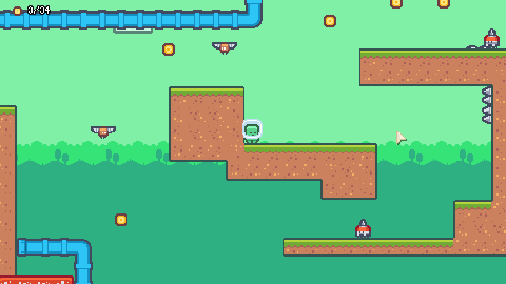
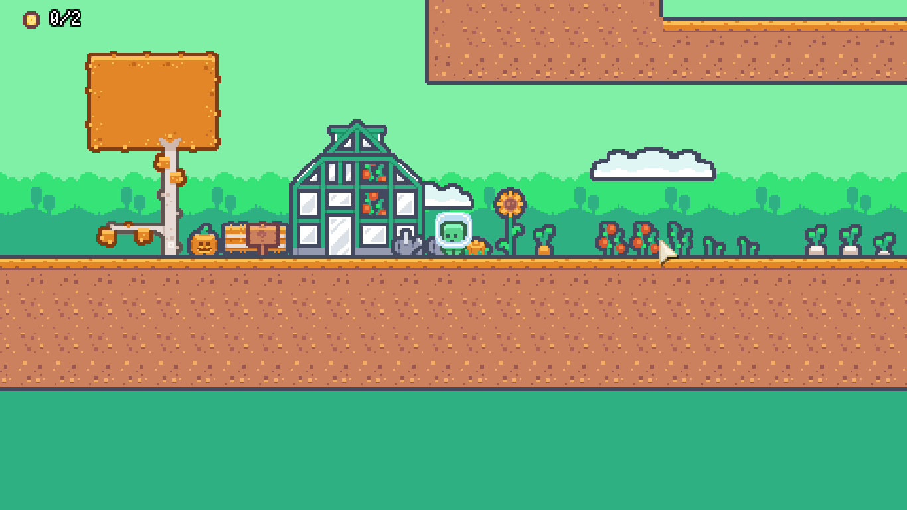
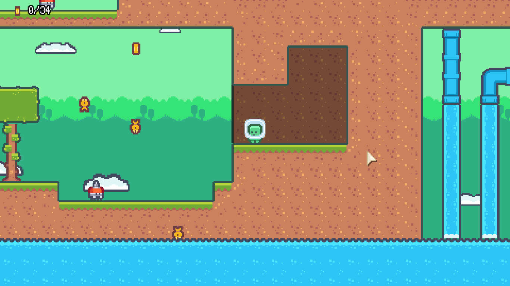

# Pixel Platformer Game

This is a pixel platformer game that I've created using Godot 4. The project was initially inspired by tutorials from [Udemy](https://www.udemy.com/share/105cXq/), which were originally designed for Godot 3. However, I've adapted these tutorials to work with Godot 4.

## Game Description

In this game, you control a character who navigates through a series of levels, jumping over obstacles, battling enemies, and collecting coins. The game features a pleasing visual aesthetic, thanks to the use of Kenney assets, which are renowned for their pixel art style. The objective is to reach the finish line in each level, while avoiding traps and enemies.
## Screenshots

## Development

I'm still learning game development, and this project has been a great way for me to apply what I've learned. I often go back to it and make some adjustments and add new levels.

## Future Plans

In the future, I plan to add more polished levels and a variety of enemies to the game. I also plan to introduce some new mechanisms to make the game more engaging. Most of my future work will be focused on adding new levels and possibly introducing some bosses to defeat.
